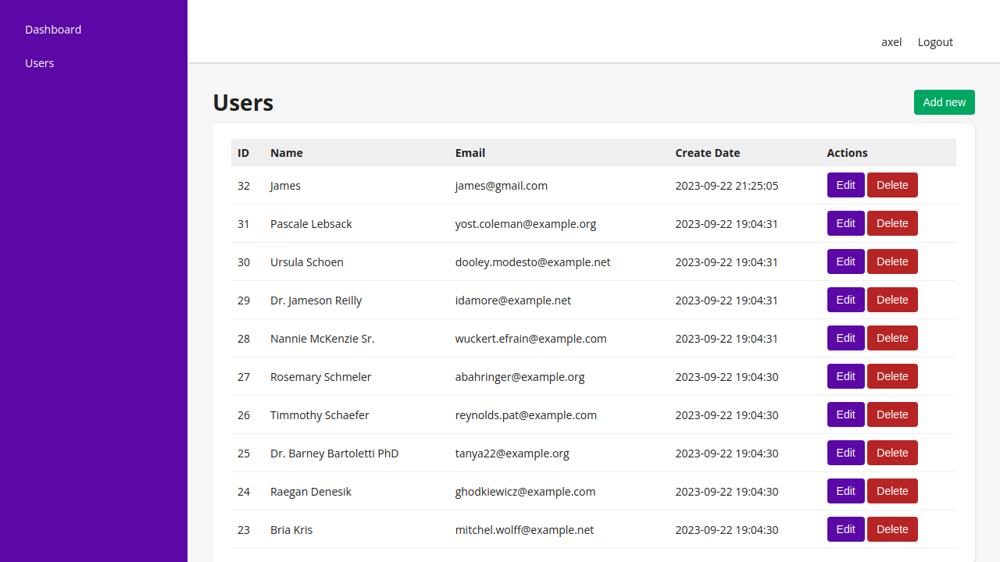
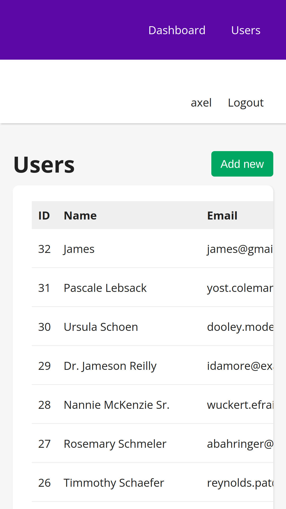

# User administration panel

## Descripción

Código base de la aplicación web User administration panel Hecha en Laravel y React.js.

---

## Vista En Versión Desktop

## Vista En Versión Mobile

---

## Hecho con

- [React](https://react.dev/) - JS library
- [React router dom](https://reactrouter.com/en/main) - For routes
- [Sweetalert](https://sweetalert2.github.io/) - For alerts
- [Laravel](https://laravel.com/) - PHP Framework

---

## Comandos

- npm i
- npm run dev
- npm run build

---

## Dependencias

- Axios
- React
- React router dom
- Sweetalert2

## Dependencias De Desarrollo

- Vite

---

## Autor

- Website - [Axe10rellana](https://axe10rellana.github.io/portafolio/portafolio/)
